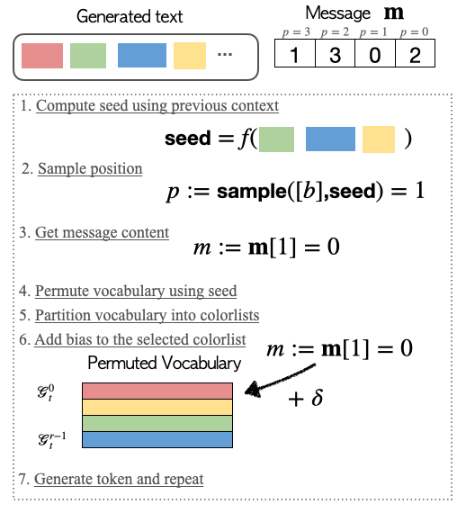
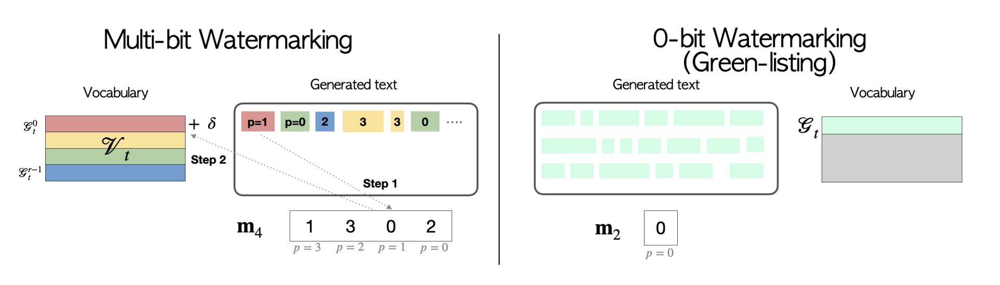
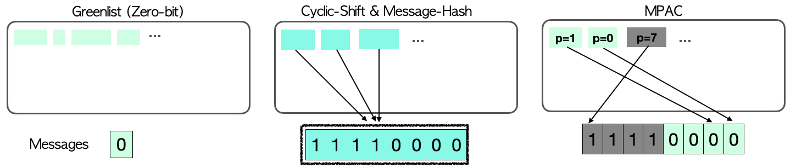

# [Advancing Beyond Identification: 0️⃣0️⃣1️⃣0️⃣1️⃣1️⃣  Multi-bit Watermark for Large Language Models (NAACL24)](https://arxiv.org/abs/2308.00221) 


### [Paper](https://arxiv.org/abs/2308.00221)

Official implementation of multi-bit watermarking and detection algorithms in the paper:

"Advancing Beyond Identification: Multi-bit Watermark for Large Language Models" by _KiYoon Yoo_, _Wonhyuk Ahn_, _Nojun Kwak_.   

#### This repository is based on the official implementation of the amazing works: 
 - "A Watermark for Large language Models" by John Kirchenbauer*, Jonas Geiping*, Yuxin Wen, Jonathan Katz, 
Ian Miers, Tom Goldstein. ([Code](https://github.com/jwkirchenbauer/lm-watermarking) | [Paper](https://arxiv.org/abs/2301.10226))
 - "On the Reliability of Watermarks for Large Language Models" by John Kirchenbauer, Jonas Geiping, Yuxin Wen, Manli Shu, 
Khalid Saifullah, Kezhi Kong, Kasun Fernando, Aniruddha Saha, Micah Goldblum, Tom Goldstein ([Paper](https://arxiv.org/abs/2306.04634))


---
### Paper Summary 
Watermarking is an effective way to mitigate misuses of 
language models through enabling identification of machine-generated texts.
How do we go beyond mere identification and embed the outputs with other meta-data that may aid
tracing back to the adversary user? Our work proposes a simple and 
effective scheme to embed **M**ulti-bit information during generation through **P**osition **A**llocation (**MPAC**).     

<p align="center">
  
</p>

### Repository Overview
Most of our multi-bit implementation is done in `./watermark_reliability_release/mb_watermark_processor.py`, 
which is basically a revision of `./watermark_reliability_release/watermark_processor.py`. 
While I did try to make it compatible with the original implementation,
I recommend you to check out the original repo if you are running experiments for zero-bit watermarking as there 
might be updates.

#### Quick Run
For a quick run, try running `bash sample-entrypoint.sh`. This will watermark 4-bit information using `gpt2-xl` on the C4 dataset.

To run on `llama-2`, change `MODEL_PATH=meta-llama/Llama-2-7b-hf` and login with your huggingface token that has been granted access.
This can be done by entering your token in `HF_ACCESS_TOKEN` and `huggingface-cli login --token $HF_ACCESS_TOKEN`

For more details about the pipeline, please refer to README.md and PIPELINE.md  in `./watermark_reliabilty_release`. 

### Guide on Multi-bit Watermark via Position Allocation (MPAC)
MPAC enables multi-bit watermarking by using two simple techniques:
1. Position Allocation: Prior to sampling, MPAC allocates token to a single position of a multi-bit message. To assign tokens in a robust and\
recovarable manner at decoding (watermark extraction), we use the hashing scheme of zero-bit watermarking, which
relies on pseudo-random functions.
2. Colorlist: To further enhance load capacity, we take advantage of entire vocabulary list by partitioning them into multiple
colored lists instead of a single greenlist. This enables representing `r`-radix message instead of a binary message using the same
greenlist proportion (`$\gamma$`). 




If you are unfamiliar with zero-bit watermarking (Kirchenbauer et al. 2023), we suggest you read the preliminary of our paper.
For a review of the configurations (e.g.`$\gamma$`, hashing scheme), checkout the below configuration section.

Below is an illustration of how using Position Allocation differs from existing multi-bit approach.



### Key configurations
Specific to multi-bit watermarking
- Message length (`MSG_LEN`): this is the bit-width of the message. In our experiments, the message length ranges from 4~64 bits.
- Radix (`RADIX`): this determines the number of colored lists (partitions) in the vocabulary. We recommend setting this
as 4 for optimal multi-bit performance.

From zero-bit watermarking
- Gamma (`GAMMA`): proportion of the favored vocabulary. Logits of the tokens in this list will be favored by adding $\delta$.
- Delta (`DELTA`): bias term to add to the greenlist. 
We mainly experiment with `GAMMA=0.25` and `BIAS=2` following the previous work. 

---
### Helpful information from the original [repository](https://github.com/jwkirchenbauer/lm-watermarking)
<details>
<summary> Configurations </summary>

**TL;DR**: As a baseline generation setting, we suggest default values of `gamma=0.25` and `delta=2.0`. Reduce delta if text quality is negatively impacted. For the context width, h, we recommend a moderate value, i.e. h=4, and as a default PRF we recommend `selfhash`, but can use `minhash` if you want. Reduce h if more robustness against edits is required. Note however that the choice of PRF only matters if h>1. The recommended PRF and context width can be easily selected by instantiating the watermark processor and detector with `seeding_scheme="selfhash"` (a shorthand for `seeding_scheme="ff-anchored_minhash_prf-4-True-15485863"`, but do use a different base key if actually deploying). For detection, always run with `--ignore--repeated-ngrams=True`.

1) **Logit bias delta**: The magnitude of delta determines the strength of the watermark. A sufficiently large value of delta recovers a "hard" watermark that encodes 1 bit of information at every token, but this is not an advisable setting, as it strongly affects model quality. A moderate delta in the range of [0.5, 2.0] is appropriate for normal use cases, but the strength of delta is relative to the entropy of the output distribution. Models that are overconfident, such as instruction-tuned models, may benefit from choosing a larger delta value. With non-infinite delta values, the watermark strength is directly proportional to the (spike) entropy of the text and exp(delta) (see Theorem 4.2 in our paper).

2) **Context width h**: Context width is the length of the context which is taken into account when seeding the watermark at each location. The longer the context, the "more random" the red/green list partitions are, and the less detectable the watermark is. For private watermarks, this implies that the watermark is harder to discover via brute-force (with an exponential increase in hardness with increasing context width h).
In the limit of a very long context width, we approach the "undetectable" setting of https://eprint.iacr.org/2023/763. However, the longer the context width, the less "nuclear" the watermark is, and robustness to paraphrasing and other attacks decreases. In the limit of h=0, the watermark is independent of local context and, as such, it is minimally random, but maximally robust against edits (see https://arxiv.org/abs/2306.17439).

3) **Ignoring repeated ngrams**: The watermark is only pseudo-random based on the local context. Whenever local context repeats, this constitutes a violation of the assumption that the PRNG numbers used to seed the green/red partition operation are drawn iid. (See Sec.4. in our paper for details). For this reason, p-values for text with repeated n-grams (n-gram here meaning context + chosen token) will be misleading. As such, detection should be run with `--ignore-repeated-ngrams` set to `True`. An additional, detailed analysis of this effect can be found in http://arxiv.org/abs/2308.00113.

4) **Choice of pseudo-random-function** (PRF): This choice is only relevant if context width h>1 and determines the robustness of the hash of the context against edits. In our experiments we find "min"-hash PRFs to be the most performant in striking a balance between maximizing robustness and minimizing impact on text quality. In comparison to a PRF that depends on the entire context, this PRF only depends on a single, randomly chosen token from the context.

5) **Self-Hashing**: It is possible to extend the context width of the watermark onto the current token. This effectively extends the context width "for-free" by one. The only downside is that this approach requires hashing all possible next tokens, and applying the logit bias only to tokens where their inclusion in the context would produce a hash that includes this token on the green list. This is slow in the way we implement it, because we use cuda's pseudorandom number generator and a simple inner-loop implementation, but in principle has a negligible cost, compared to generating new tokens if engineered for deployment. A generalized algorithm for self-hashing can be found as Alg.1 in http://arxiv.org/abs/2306.04634.

6) **Gamma**: Gamma denotes the fraction of the vocabulary that will be in each green list. We find gamma=0.25 to be slightly more optimal empirically, but this is a minor effect and reasonable values of gamma between 0.25 and 0.75 will lead to reasonable watermark. A intuitive argument can be made for why this makes it easier to achieve a fraction of green tokens sufficiently higher than gamma to reject the null hypothesis, when you choose a lower gamma value.

7) **Base Key**: Our watermark is salted with a small base key of 15485863 (the millionth prime). If you deploy this watermark, we do not advise re-using this key.
</details>

<details>
<summary> Implementation </summary>
Implementation is based on the "logit processor" abstraction provided by the [huggingface/transformers 🤗](https://github.com/huggingface/transformers) library.

The `WatermarkLogitsProcessor` is designed to be readily compatible with any model that supports the `generate` API.
Any model that can be constructed using the `AutoModelForCausalLM` or `AutoModelForSeq2SeqLM` factories _should_ be compatible.

The core implementation is defined by the `WatermarkBase`, `WatermarkLogitsProcessor`, and `WatermarkDetector` classes in the file `watermark_processor.py`.
The `demo_watermark.py` script implements a gradio demo interface as well as minimum working example in the `main` function.

Details about the parameters and the detection outputs are provided in the gradio app markdown blocks as well as the argparse definition.

The `homoglyphs.py` and `normalizers.py` modules implement algorithms used by the `WatermarkDetector`. `homoglyphs.py` (and its raw data in `homoglyph_data`) is an updated version of the homoglyph code from the deprecated package described here: https://github.com/life4/homoglyphs.
The `experiments` directory contains pipeline code that we used to run the original experiments in the paper. However this is stale/deprecated
in favor of the implementation in `watermark_processor.py`.


### Abstract Usage of the `WatermarkLogitsProcessor` and `WatermarkDetector`
Implementation is based on the "logit processor" abstraction provided by the [huggingface/transformers 🤗](https://github.com/huggingface/transformers) library.

The `WatermarkLogitsProcessor` is designed to be readily compatible with any model that supports the `generate` API.
Any model that can be constructed using the `AutoModelForCausalLM` or `AutoModelForSeq2SeqLM` factories _should_ be compatible.

Generate watermarked text:
```python
watermark_processor = WatermarkLogitsProcessor(
        vocab=list(tokenizer.get_vocab().values()),
        gamma=args.gamma,
        delta=args.delta,
        seeding_scheme=args.seeding_scheme,
        store_spike_ents=args.store_spike_ents,
        select_green_tokens=True,
        message_length=args.message_length, # specific to multi-bit watermark
        base=args.base, # specific to multi-bit watermark
        device="cuda" if (args.use_gpu and torch.cuda.is_available()) else "cpu",
        **wm_kwargs
    )

tokenized_input = tokenizer(input_text).to(model.device)
# note that if the model is on cuda, then the input is on cuda
# and thus the watermarking rng is cuda-based.
# This is a different generator than the cpu-based rng in pytorch!

output_tokens = model.generate(**tokenized_input,
                               logits_processor=LogitsProcessorList([watermark_processor]))

# if decoder only model, then we need to isolate the
# newly generated tokens as only those are watermarked, the input/prompt is not
output_tokens = output_tokens[:,tokenized_input["input_ids"].shape[-1]:]

output_text = tokenizer.batch_decode(output_without_watermark, skip_special_tokens=True)[0]
```

Detect watermarked text:
```python
watermark_detector = WatermarkDetector(vocab=list(tokenizer.get_vocab().values()),
                                        gamma=0.25, # should match original setting
                                        seeding_scheme="simple_1", # should match original setting
                                        device=model.device, # must match the original rng device type
                                        tokenizer=tokenizer,
                                        z_threshold=4.0,
                                        normalizers=[],
                                        ignore_repeated_bigrams=True,
                                        message_length=args.message_length, # specific to multi-bit watermark
                                        base=args.base, # specific to multi-bit watermark
                                       )

score_dict = watermark_detector.detect(output_text) # or any other text of interest to analyze
```
</details>


